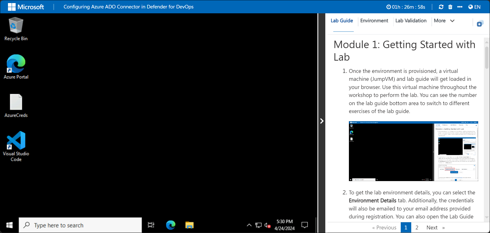

# Cloud Native Application Protection Platform - CNAPP

### Overall Estimated Duration: 8 hours

## Overview

## Objective

The objective of the CNAPP lab is to equip participants with the skills to secure and manage cloud-native applications through hands-on experience in visibility, risk assessment, and threat detection. Participants will learn to identify vulnerabilities, implement security controls, and integrate security into the DevOps pipeline, enabling proactive protection of applications and data in dynamic cloud environments.

- **Defender Cloud Security Posture Management:** To enhance cloud security by assessing and improving the security posture of cloud environments through continuous monitoring and compliance checks. 
- **Defender for Containers:** To secure containerized applications by providing visibility, threat detection, and vulnerability management throughout the container lifecycle.
- **Configuring Azure ADO Connector in Defender for DevOps:** To enable seamless integration between Azure DevOps and Defender for DevOps, enhancing security insights and risk management within CI/CD pipelines.
- **Integrating Defender for DevOps with GitHub Advanced Security:** To strengthen application security by combining GitHub Advanced Security features with Defender for DevOps for comprehensive code scanning and threat protection.

## Prerequisites

Participants should have:

- **Basic Cloud Knowledge:** Familiarity with cloud computing concepts and services (e.g., AWS, Azure, Google Cloud).
- **Understanding of Containerization:** Knowledge of container technologies such as Docker and Kubernetes.
- **Security Fundamentals:** A grasp of basic cybersecurity principles and practices.
- **DevOps Concepts:** Awareness of DevOps methodologies and practices, including CI/CD pipelines.
- **Scripting Skills:** Basic proficiency in scripting languages (e.g., Python, Bash) for automation tasks.
- **Networking Basics:** Understanding of networking concepts relevant to cloud environments.

## Architechture

The architecture of the lab integrates various Azure services and components to create a secure, scalable environment for cloud-native applications. At the core, Azure Defender for Cloud monitors and manages the security posture of both Azure and hybrid environments, ensuring compliance and risk mitigation. Containerized applications are deployed and orchestrated using Azure Kubernetes Service (AKS) and Docker, providing flexibility and efficiency. Azure DevOps Services facilitate continuous integration and delivery (CI/CD) processes, while the Azure ADO Connector enhances security insights within these workflows. GitHub serves as the version control platform, integrating advanced security features to safeguard code. Additionally, Azure Virtual Machine Scale Sets ensure that applications can scale dynamically and maintain high availability, while Azure Active Directory manages user authentication and access across the entire architecture, creating a comprehensive security framework for cloud-native application development and deployment.

## Architechture Diagram

## Explanation of Components

The architecture for this lab involves the following key components:

- **Azure Defender for Cloud:** A unified security management system that helps protect Azure and hybrid environments, ensuring compliance and security posture management.
- **Docker:** A platform for developing, shipping, and running applications in containers, allowing for consistent environments across different stages of development.
- **Azure Kubernetes Service (AKS):** A managed container orchestration service that simplifies deploying, managing, and scaling containerized applications using Kubernetes.
- **Azure DevOps Services:** A suite of development tools that support planning, collaboration, and CI/CD practices, enabling teams to build and deploy applications efficiently.
- **GitHub:** A platform for version control and collaboration that allows developers to host code repositories and utilize advanced security features for their projects.
- **Azure Virtual Machine Scale Sets:** A service that enables the deployment and management of a set of identical, load-balanced virtual machines, providing scalability and high availability for applications.

## Getting Started with the Lab
 
Welcome to your Cloud Native Application Protection Platform - CNAPP Workshop! We've prepared a seamless environment for you to explore and learn about Azure services. Let's begin by making the most of this experience:
 
## Accessing Your Lab Environment
 
Once you're ready to dive in, your virtual machine and lab guide will be right at your fingertips within your web browser.

### Virtual Machine & Lab Guide
 
Your virtual machine is your workhorse throughout the workshop. The lab guide is your roadmap to success.
 
## Exploring Your Lab Resources
 
To get a better understanding of your lab resources and credentials, navigate to the **Environment** tab.
 

 
## Utilizing the Split Window Feature
 
For convenience, you can open the lab guide in a separate window by selecting the **Split Window** button from the Top right corner.
 

 
## Managing Your Virtual Machine
 
Feel free to start, stop, or restart your virtual machine as needed from the **Resources** tab. Your experience is in your hands!

## Login to Azure Portal

1. In the JumpVM, click on the Azure portal shortcut of the Microsoft Edge browser from the desktop.

   
   
1. On the **Sign in to Microsoft Azure** tab you will see a login screen, enter the following email/username and then click on **Next**.
   
   * Email/Username: **<inject key="AzureAdUserEmail" enableCopy="true"/>** 
   
     
     
1. Now enter the following password and click on **Sign in**.
   
   * Password: **<inject key="AzureAdUserPassword" enableCopy="true"/>**
   
     
     
1. On **Action Required** pop-up, click on **Ask later**.

   

   >**NOTE:** Do not enable MFA, select **Ask Later**.

1. If you see the pop-up **Stay Signed in?**, click **No**.

1. If you see the pop-up **You have free Azure Advisor recommendations!**, close the window to continue the lab.

1. If a **Welcome to Microsoft Azure** popup window appears, click **Maybe Later** to skip the tour.
   
1. Now you will see Azure Portal Dashboard, click on **Resource groups** from the Navigate panel to see the resource groups.

   
   
1. Confirm you have a resource groups present as shown in the below screenshot.

   
   
## Support Contact
 
The CloudLabs support team is available 24/7, 365 days a year, via email and live chat to ensure seamless assistance at any time. We offer dedicated support channels tailored specifically for both learners and instructors, ensuring that all your needs are promptly and efficiently addressed.

Learner Support Contacts:
- Email Support: labs-support@spektrasystems.com
- Live Chat Support: https://cloudlabs.ai/labs-support

Now, click on **Next** from the lower right corner to move on to the next page.

### Happy Learning!!
